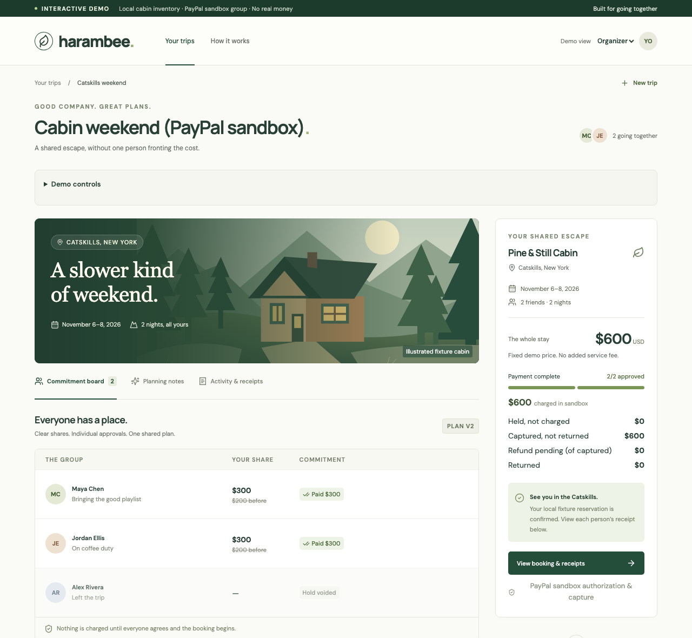

# Harambee — group trips where nobody fronts the money

**A little agreement. A great escape.** *Harambee* means “all pull together” in Swahili.



*The board above is the [recorded PayPal sandbox booking](docs/evidence/2026-10-04-sandbox-booking/README.md): Alex left, his authorization was voided, Maya and Jordan each authorized a $100 top-up, and $600 was captured.*

> **Judging in 3 minutes?** `npm ci && npm run dev`, open http://127.0.0.1:5171, and follow the [demo walkthrough](#demo-walkthrough) (no credentials needed). What's real vs simulated is in the table below; the PayPal evidence is in [`docs/evidence/`](docs/evidence/2026-10-04-sandbox-booking/README.md); the AI's live results and their caveats are under [Revision options](#revision-options-after-a-dropout).

**The problem:** one friend books the $600 cabin, then spends weeks chasing everyone for their share. When someone drops out, that friend absorbs the gap.
**Who it’s for:** groups of 3–8 friends booking a shared stay.
*Context, not our data:* in 2017 Airbnb reported that an estimated 38% of guests hadn’t received all the money owed to them from group trips ([VentureBeat](https://venturebeat.com/ai/airbnb-now-lets-groups-of-guests-split-the-cost-of-their-stay)), and in 2024 PayPal relaunched money pools for group trips and gifts, citing customer demand ([TechCrunch](https://techcrunch.com/2024/11/19/paypal-revives-its-money-pooling-feature/)). We have no user research of our own yet.

**How it works:**

1. Each friend approves their own exact share with a **PayPal authorization**. It is a hold, not a charge, and nobody is charged until everyone is in.
2. When someone drops out, their hold is voided. The group’s chat becomes **verified revision options**: a model proposes, and code checks every quote and computes every share. A limit like “I can’t go above $170” only counts once that person confirms it.
3. Everyone approves the new version. Earlier approval never covers an increase, so each person authorizes only the difference in their own PayPal checkout. Then Harambee captures and books.

Holds are collected within a 48-hour window and captured as soon as the group books, inside PayPal’s 3-day honor period for authorizations (an authorization stays valid for 29 days and can be reauthorized; see [PayPal: authorization](https://developer.paypal.com/docs/checkout/standard/customize/authorization/)).

| Real | Simulated or pending |
| --- | --- |
| PayPal sandbox orders, authorizations, voids and captures from three separate buyers. See the [recorded sandbox group booking](docs/evidence/2026-10-04-sandbox-booking/README.md). | The cabin and its reservation (local sample listing; no lodging is purchased) |
| Versioned consent, the exact-difference top-ups, and recovery that never charges twice (84 tests) | Default no-credentials mode simulates payments |
| AI revision options against a live model (gpt-4.1-mini), with code checks and an ambiguity backstop: in no live run could a publishable option exceed a saved budget; the last two live runs were 25/26 and 24/26 synthetic briefs useful, versus 23/26 for the no-AI local planner ([details and caveats](#revision-options-after-a-dropout)) | No user research; synthetic briefs only |

## How this differs

As of October 2026, in what we found:

| What exists | What it does | What Harambee adds |
| --- | --- | --- |
| “Nobody pays until everyone pays” group checkout ([PayByGroup, 2012](https://techcrunch.com/2012/09/25/no-more-awkward-you-owe-me-money-reminders-paybygroup-lets-friends-split-group-purchases)) and tipping-point collection ([Crowdtilt/Tilt](https://en.wikipedia.org/wiki/Tilt.com), acquired by Airbnb in 2017) | Each person commits a share; nobody is charged unless the whole amount is reached | This is the closest prior art, and the all-or-nothing idea is theirs. Harambee adds what happens when the group *changes* after people have committed: a new version, fresh consent, and only the difference authorized |
| Split payment at booking ([Airbnb, 2017](https://techcrunch.com/2017/11/28/airbnb-launches-payment-splitting-for-group-trips/), reportedly withdrawn later; [Wander “Split with Friends”, 2025](https://wander.com/article/introducing-split-with-friends-an-industry-first)) | The organizer pays their part to hold the dates; others pay within a window (48 hours at Wander) | Holds instead of charges for everyone, including the organizer, and a plan that can change after someone leaves |
| Group collection ([PayPal pools](https://techcrunch.com/2024/11/19/paypal-revives-its-money-pooling-feature/), [Venmo Groups](https://techcrunch.com/2023/11/14/venmo-gets-a-new-way-to-split-expenses-among-groups-like-clubs-teams-trip-buddies-and-more), Splitwise) | Collects or tracks money owed to one person | Each friend’s authorization goes to the merchant; nobody acts as the group’s bank |
| AI trip planners with group chat ([Mindtrip](https://globetrender.com/2024/09/24/mindtrip-launches-group-chat-feature/)) | Turn shared preferences into an itinerary | Turn a dropout into price options that are checked by code and re-approved by each person |
| **The new part** | | When the group changes, a new version needs fresh consent from everyone remaining, and each person authorizes only the difference. Earlier approval never covers an increase. |

Each building block exists elsewhere: all-or-nothing group commitment, authorizations, split checkout, and extracting details from chat with a model. The narrower contribution is consent after a dropout: a versioned agreement where an earlier approval never covers a higher share, each person authorizes only the difference, and limits read from chat count only once their owner confirms them.

## Who is the merchant, and who pays

The cabin operator is the merchant. In a real deployment, each friend’s authorization would be made to the operator’s own PayPal business account, so Harambee never holds or moves the group’s money. PayPal supports this for platforms through its [multiparty](https://developer.paypal.com/docs/multiparty/) integration. For authorize-then-capture, the order and the authorization name the seller as `payee` ([multiparty authorize and capture](https://developer.paypal.com/docs/multiparty/checkout/standard/customize/auth-capture/)). That page requires an approved PayPal partner, sellers onboarded first, and the `PARTNER_FEE` onboarding feature for a platform fee. (PayPal's multiseller page requires `intent: CAPTURE`, so it doesn't fit a hold-first design.) We are not an approved partner. This prototype is not that integration: sandbox captures land in its own sandbox merchant account.

Hypotheses, not results:

- Operators who take direct bookings would accept several authorizations for one stay, because every share is held before dates are committed.
- Groups would accept a small disclosed platform fee so that one friend doesn’t front the cost.
- Who absorbs processing costs on released holds and refunds after a failed booking is an open question for operator conversations.

## Run locally

Requires Node.js 22+ and npm. No credentials are needed for the default demo.

```sh
npm ci
npm run dev
```

Open [Harambee](http://127.0.0.1:5171). Vite serves the UI on port 5171 and proxies API requests to port 3101. The backend does not auto-restart when you edit server files; restart `npm run dev` after backend changes. Frontend updates reload automatically.

For one local production server:

```sh
npm run build
npm start
```

Open [the production build](http://127.0.0.1:3101). Do not run the dev and production backend simultaneously. `PORT`, `HOST`, and `DATA_FILE` can override local defaults; Vite's API proxy expects port 3101.

```sh
npm test
```

The native Node test suite covers exact allocations, private budget projection, role checks, stale version rejection, explicit top-ups, duplicate operations, deadlines, cabin capacity, restart persistence, capture failures and timeouts, refunds pending confirmation, merchant failures, and sandbox adapter contracts. GitHub Actions runs tests and a production build.

## Demo walkthrough

1. Start with four friends and the $600 Pine & Still cabin. Click **Review** beside each person, review their saved private $220 ceiling (use **Save budget only** for edits), and select **Agree & authorize simulated hold**. The demo role switch intentionally lets one judge act as each participant.
2. Switch to Organizer. Withdraw Sam using the exit icon. Their hold is voided, and the plan requires a revision.
3. Choose **Suggest options**. Harambee reads the group chat pasted into **Planning notes**. In the sample chat Sam leaves, Maya says she “can’t go above $170” now, and Alex prefers the cheaper cabin. Code computes every share and top-up for the verified options, and each AI option lists the chat lines behind it. Maya’s $170 option waits for her: choose **Send Maya a confirmation request**, then open Maya’s view (**Demo controls → Open Maya’s view**) and confirm there. The organizer’s card updates by itself. The plain rebalance ($200 each) and the cheaper cabin ($160 each) are also offered; an option that produces exactly the same split as another is shown once. See [Revision options](#revision-options-after-a-dropout).
4. Publish an option. Each remaining friend explicitly approves the new version and their exact top-up. The original version never grants permission for an increase.
5. Return to Organizer and book. The system locks the plan, captures each simulated payment, and commits local inventory. Open **Activity & receipts** or export the JSON evidence.
6. Reset and approve the group again. Under **Demo scenarios**, choose a capture failure or timeout before booking. The board says in plain words whose payment failed and what will be returned. **Return money & release holds** checks each payment with the provider, refunds confirmed captures, voids unused holds, and releases inventory. The pending-refund scenario requires a second recovery pass; it cannot falsely report completion.
7. If nobody's limits can cover any cabin (withdraw two people), the options say so and offer **Cancel trip & release every hold**.
8. For the constrained-budget case, set one remaining person's ceiling to $170 during review, then republish the allocation as Organizer. The deterministic split is $170/$215/$215. **View allocation details** also offers the $480 alternative; a changed cabin requires new consent.

New trips accept three to eight distinct names and a fixed fixture stay on November 6–8, 2026. Creekside has capacity for six, Pine & Still for eight. Unknown ceilings require participant confirmation before approval. The demo allows two people to remain after a withdrawal.

## Optional AI interpretation

```sh
cp .env.example .env
```

Set `OPENAI_API_KEY` and optionally `OPENAI_MODEL`, then restart. In **Planning notes**, choose **Find the preferences**. The server uses the OpenAI Responses API with a strict structured-output schema, a 12-second timeout, exact source-quote validation, and bounded input/output. Model credentials never reach the browser. No model receives payment tools.

Without a key, or if the model times out or returns unverified content, the app explicitly uses a **local parser**. That fallback is not an AI model. Both paths produce reviewable drafts only: they cannot change budgets, consents, amounts, or payment states. Notes and interpretations are not persisted; they remain in browser memory until reload. If the model is enabled, submitted text is sent to its provider with `store: false`. Do not submit unconsented personal conversations. Latency and token usage are displayed for model responses; provider cost is not calculated. Source-linked drafts now check extracted amounts and names against conservative line-level USD grounding. Contradictions lose their numeric suggestion; discrepant model fields are replaced by source-grounded values and explicitly flagged. This is not a general semantic verifier. Each draft can open a participant review with the source visible; applying a suggestion to the field, saving a budget, and approving a share remain separate actions. No user research or live model accuracy is claimed.

Run `npm run eval` for the frozen 22-case synthetic parser/validator evaluation. `eval/results.json` records 22/22 locally passing cases, including three injected model-output mistakes. This is **not** 100% model accuracy. `npm run eval:live -- --write` explicitly calls the configured provider and records separate live results. This notes-interpreter eval has not been run live; the live runs below cover revision options. Measure real participant correction effort using [the study protocol](docs/VALIDATION_PLAN.md).

Reference: [OpenAI Structured Outputs](https://developers.openai.com/api/docs/guides/structured-outputs).

## Revision options after a dropout

When someone leaves, the organizer chooses **Suggest options**. With `OPENAI_API_KEY` set, a model reads the group chat and proposes up to three options. Each option picks a cabin and can include a spending limit a person stated about themselves, quoted from their own message. The model interprets meaning, so “I can’t go above $170” counts as a $170 limit. It writes the explanation without figures. It never receives anyone’s saved private budget.

Code then decides what is shown:

- Every quote must appear in that person’s own message.
- Every amount must be literally written there, as digits or as spoken words such as “two hundred dollars”.
- The cabin must fit the group.
- Shares and top-ups are computed by the same allocator that publishes versions.
- Figures in the model’s prose, summary and questions must match the computed or quoted amounts, including bare numbers like “Alex covers 300”; otherwise code rewrites the explanation, drops the summary, or replaces the question.
- A reason is shown as **Why** only if it supports that option. A quote that names a different cabin, or a limit below what the option asks that person to pay, is listed separately as “points to another option”. Reasons must be real phrases, not a name or a two-word fragment.
- Failing suggestions are listed as discarded, and ambiguity becomes a clarification question.
- The plain rebalance is always included for comparison.

If a person’s stated limit sets their share in an option, that option can’t be published until they explicitly confirm the limit in their own view (**Send Maya a confirmation request**). Confirming makes it their saved budget. Options are stored on the server and published by ID, so neither the shares nor the “suggested by” record come from the browser. Publishing recomputes the split from saved budgets and refuses if anything changed, before any real authorization is released. Each person then approves their own new share and top-up.

Privacy: the model never receives saved budgets, and nothing compares a proposed limit with anyone’s private budget. While an option still waits on someone’s confirmation, its preview is computed only from limits stated in the chat and the cabin total. Saved budgets don’t enter it, so chat the organizer writes can’t steer a preview into revealing one. Once nothing is waiting, the preview is exactly the split that publishing produces from saved budgets. That split is fixed for each cabin, so chat input can’t probe it, and it reveals only what a published split would. Option requests are also limited to five per plan version, and each is recorded in Activity with the amounts read from the chat. Confirmed limits and open requests are visible only to their owner and the organizer, and the shared activity log records that someone confirmed, not the amount. When someone types a firm limit in answer to a question, the organizer sees only that they answered; if that limit caps their share, the share will equal it, as with any budget.

Requests go to the person, not the organizer’s screen: **Send Maya a confirmation request** puts a card at the top of Maya’s own view, quoting her message, and an uncertain message gets **Ask Maya for a firm limit**, which asks her to type one. A one-click confirmation can lower a saved budget but never raise it, because the organizer wrote the pasted chat; raising it is a separate budget edit. Requests belong to one plan version and expire when a new one is published. **Not now** is recorded for the organizer, and an answer shows on the organizer’s card as “answered”. Each AI option lists its reasons as quotes from people’s own messages (“Why: … — Alex, line 7”), and the panel shows what the model read. An option with the same split as the plain rebalance is tagged as such: “Standard rule” when the model gave no verified reasons for it, or “AI suggestion · same split as the standard rule” when it did. When a confirmation makes two cards identical, they become one card that says why. Code also flags a firm limit no option uses, and marks any option that asks someone for more than they wrote.

Without a key, or if the model fails, a **local planner (not AI)** takes the latest dollar amount each person wrote, without interpreting wording. Anyone whose share depends on it must confirm.

`npm run eval:revisions` runs 12 frozen briefs from the PRD acceptance spec (clear, ambiguous, infeasible, adversarial) through the real verifier using hand-written reference answers, two of them deliberately unsafe. [`eval/revision-results.json`](eval/revision-results.json) records 12/12 with no unsafe option shown. That measures the verifier, **not** model quality. `npm run eval:revisions:live -- --write` measures the configured model (gpt-4.1-mini, 2–5 s per call). In no live run could a publishable option exceed a saved budget, because every limit stated in chat needs its owner's confirmation and publishing recomputes from saved budgets. By the eval's stricter definition, which also forbids *showing* certain limits, one run was not fully safe: before the backstop, the fresh set recorded [5/6 safe](eval/revision-holdout2-results-live-baseline.json) because a hedged “$160ish” was offered as Maya's pending limit.

**Ambiguity backstop.** Some messages are too uncertain to use as a limit whatever the model says. If every sentence stating the amount is hedged (“probably $160ish?”, “I guess $170”, “~$170”), states something other than a ceiling (“I can’t do $170”, “at least $170”), gives two amounts (“$175 or $185”), contradicts the person’s later message, reports someone else’s limit (“Jordan said $170 is fine”), or reads like an instruction to the system, code removes it from every option. Amounts that aren’t a ceiling (“I already sent you $50 for gas”, “$100 a night”, “I’m no longer capped at $170”, “$170 is fine for me”) and abbreviations like “$1.2k” are never offered as one-click limits. Code then asks that person a question, labelled “flagged by code”. It also checks each person’s latest amount itself, so an uncertain one is questioned even if the model ignored it. Firm limits, an updated figure (“make that $190”) and an unrelated “might” in another sentence pass through.

| Live run | Frozen 12 | Held-out 8 | Fresh 6 |
| --- | --- | --- | --- |
| [First run](eval/revision-results-live-baseline.json) | 8/12 | [7/8](eval/revision-holdout-results-live-baseline.json) | — |
| [Prompt change + keep option, drop bad limit](eval/revision-results-live-tuned.json) | 12/12 | [6/8](eval/revision-holdout-results-live-tuned.json) | [5/6](eval/revision-holdout2-results-live-baseline.json), with one hedged limit shown |
| [Backstop](eval/revision-results-live-backstop.json) | 12/12 | [8/8](eval/revision-holdout-results-live-backstop.json), matched in 2 uncommitted repeats | [6/6](eval/revision-holdout2-results-live-backstop.json), matched in 2 uncommitted repeats |
| [Round six: reasons, new prompt example, wider backstop](eval/revision-results-live-round6.json) | 11/12 | [8/8](eval/revision-holdout-results-live-round6.json) | [6/6](eval/revision-holdout2-results-live-round6.json) |
| [Round seven: reasons must support the option, bare-number and not-a-limit checks](eval/revision-results-live-round7.json) | 10/12 | [8/8](eval/revision-holdout-results-live-round7.json) | [6/6](eval/revision-holdout2-results-live-round7.json) |

In the round-six miss, the model offered the cheaper cabin without applying the stated limits; the card now flags that it asks Jordan for more than the $150 he wrote. Round seven missed that brief again, and also one it passed in round six: on a message with no amount, the model asked nothing that time. Neither miss involves the new checks; it is run-to-run variation. In a first round-seven attempt two model calls failed and fell back to the local planner; those two sets were re-run and the fallback results discarded, since they weren't model results. [Three live runs of the demo’s own sample chat](eval/demo-chat-live-runs.json) agree on the main result each time: only Maya needs to confirm, at $170 / $215 / $215. That card’s reasons are Maya’s new limit and Jordan’s “I can stretch a bit if that keeps us at Pine & Still”, and Alex’s Creekside preference is shown on it as pointing to another option. The model’s questions vary from run to run.

Read these numbers with care.

- The frozen set and the first held-out set shaped the changes, so their later results are optimistic.
- The [fresh six](eval/revision-cases-holdout2.json) were committed and run before the backstop existed. But the same developer wrote both the briefs and the rules, after seeing the earlier failure types, so they are not independent.
- These are small synthetic sets and single committed runs per round (the two backstop repeats were not saved), with no user data. Two rounds on nearly the same code gave 25/26 and 24/26, so treat a one-brief difference as noise.
- The [no-AI local planner, run through the same checks](eval/local-planner-baseline.txt), is useful on 23/26 and safe on 26/26, against the model’s 24–25/26. It also produces the sample chat’s $170 / $215 / $215 table. On these briefs the model’s measurable edge is the three messages with no dollar amount (“I can stretch a bit”, “I might not come either”, “I could maybe go a little higher”), where it asks instead of staying silent, plus the reasons it shows for each option. The code does most of the work, by design.
- The backstop is a keyword list, not a language model. It is a floor for common phrasings. Per-person confirmation is the real guarantee.

## Integrated PayPal sandbox group

1. Configure sandbox merchant credentials in `.env`, run `npm run paypal:check` to confirm PayPal accepts them, restart, and start an unfunded trip with three distinct participants. Set each private ceiling to at least $300 for the $600 trip if demonstrating a dropout to two remaining buyers.
2. As Organizer open **Demo controls** and choose **Use PayPal sandbox for this group**. Participant links open separate tab-scoped views; they are local demo selectors, not authentication. Use distinct sandbox buyer accounts and separate browser profiles for their PayPal logins.
3. Each participant reviews the exact version/share, saves their budget separately, and approves. **Agree & open sandbox checkout** sends that buyer to PayPal in the same tab. After approval PayPal returns them to their participant view, which asks the server to authorize the order; **I approved in PayPal — confirm authorization** remains as a manual fallback. Server state validates the exact USD amount and unique buyer identity. Browser approval alone never counts as a hold. A buyer already holding another participant's share has the new hold voided and is asked to use a different sandbox account.
4. Withdraw one participant. Their actual sandbox authorization must be voided before the new version is published. Remaining participants explicitly approve the revised version and additional amount only, then complete their top-up checkouts. Original consent cannot authorize an increase.
5. Book once every exact current share is authorized. Provider captures run sequentially against persisted authorization IDs, followed by a **local fixture** reservation commit. Export the provider-labeled receipt evidence.
6. In a separate prepared trip select **Merchant commit fails** before booking to exercise compensating refunds. Reconcile until every refund/void is confirmed. An unknown operation remains blocked with investigation guidance; never create a replacement charge. Inspect sandbox activity if the provider cannot supply a recoverable ID.

`test/group-payments.test.mjs` verifies this integrated journey with mocked buyers/providers, restart between provider and coordinator saves, partial capture, unresolved capture, stale checkout, distinct buyers, and fixture-commit failure. The booking journey has also run against the real PayPal sandbox; see the [recorded evidence](docs/evidence/2026-10-04-sandbox-booking/README.md). This is a single-process local prototype with polling reconciliation and no webhooks. The diagnostic lab cannot operate on group-linked sessions. Reset refuses unresolved sandbox money. After a confirmed booking it first archives the trip's provider evidence to `data/archive/`.

## Optional PayPal sandbox lab

Set `PAYPAL_CLIENT_ID` and `PAYPAL_CLIENT_SECRET` to a **sandbox** merchant application's credentials, restart, then open **PayPal sandbox lab** beneath the booking sidebar in Organizer view.

1. Create a sandbox order between $1 and $500.
2. Open the generated PayPal approval link and approve using a separate sandbox buyer account.
3. Return and confirm authorization. Server-side provider state is authoritative; browser approval alone does not mark it authorized.
4. Capture the displayed exact test amount, or void the unused authorization.
5. Refund a captured payment, and reconcile pending or unknown results.

The adapter is pinned to `https://api-m.sandbox.paypal.com`; there is no live profile. It persists operation IDs before dispatch, uses `PayPal-Request-Id`, separates authorization/capture/refund statuses, and serializes each lab session. Timeouts become unknown. Reconciliation queries PayPal; an unknown order or capture without a recoverable provider ID requires inspection in the sandbox dashboard and is never automatically recharged. The default demo reset does not delete sandbox operation evidence.

This diagnostic lab is a **single-payment workflow**, separate from the integrated group path above. Authenticated webhook verification remains a release gate. The shared adapter has run against the real sandbox through the integrated group path; the lab's own steps are covered by mocked tests.

References: [PayPal delayed capture](https://developer.paypal.com/checkout/delay-capture/), [Payments v2](https://developer.paypal.com/docs/api/payments/v2/), [Orders v2](https://developer.paypal.com/docs/api/orders/v2/).

## Implementation

- React + Vite frontend with responsive desktop/mobile layouts, keyboard-operable native dialogs, labeled inputs, visible focus, and reduced-motion support.
- Node HTTP backend; integer-cent deterministic capped allocation; versioned consent and independent agreement/payment states.
- Atomic JSON snapshots in `data/plan.json`; a separate `data/sandbox-lab.json` retains sandbox evidence. Each simulator operation has a unique stable key and is stored before its confirmed result.
- A single backend process serializes all mutation requests, including asynchronous provider calls. This is not a distributed database or multi-process locking scheme.
- The booking coordinator stops after a failed/unknown capture. It reconciles uncertainty before refunding captures and voiding unused holds. A merchant commit timeout can reconcile to confirmed without repeating captures.
- Deadlines sweep on startup, on API access, and every 30 seconds while the process runs. Expired simulated holds are voided and late approvals rejected. Sandbox expiry runs the asynchronous provider recovery path; uncertainty keeps recovery open.
- Demo roles are checked at API actions; budgets are projected only to their participant identity. **The role switch is not authentication.** Keep this local until real identity/session authorization is implemented.

## Scope and release gates

This is a usable hackathon MVP, not a production payment service. It intentionally uses a single current trip, local merchant fixtures, fixed stay dates, and a visible demo role switch. The first real-money release would require real authentication, isolated user accounts and durable transactional storage; broader live evidence (refund recovery against PayPal has not yet been recorded); verified and deduplicated webhooks; reservation inventory integration; provider reconciliation jobs; retention policy and deletion controls; and observed user/evaluation evidence.

Public hosting is not configured. Default binding is loopback, and the API accepts only local browser origins. No real merchant reservations, payouts, organizer wallets, money transmission, real payment success, fee economics, or user impact are claimed. Google Fonts is the only optional external asset request; system fonts are fallbacks. The cabin art is original inline SVG and works offline.

Use synthetic data. Demo reset clears the simulated trip's stored record; notes never persist. Local financial fixtures remain until reset/deletion, and sandbox audit records remain until explicitly removed after reconciliation. Do not delete unresolved sandbox evidence. These defaults do not establish a production financial-data retention policy.

See [PRD.md](PRD.md) for the original proposed scope, [HACKATHON.md](HACKATHON.md) for judging plans, [SHARED_REQUIREMENTS.md](SHARED_REQUIREMENTS.md) for shared submission requirements. The PRD remains a proposal; this README describes what is actually implemented.

MIT licensed. Source: [github.com/Jeremiah-Sakuda/harambee](https://github.com/Jeremiah-Sakuda/harambee).
