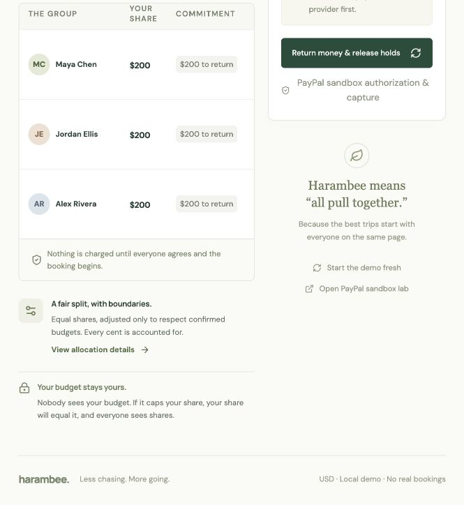
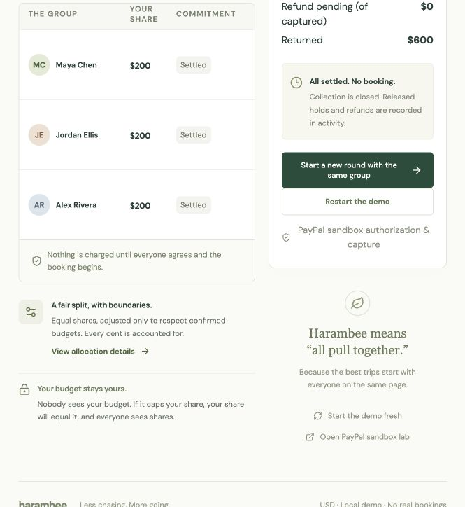
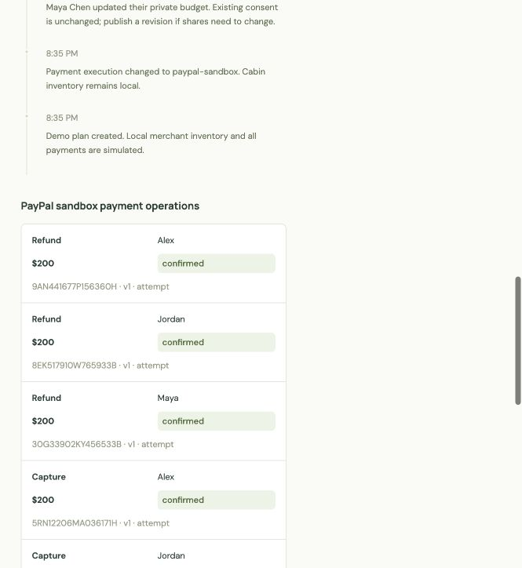

# Real PayPal sandbox group refund — October 8, 2026

**Passed: three distinct buyers, $600 captured, $600 refunded, no booking.** The local fixture reservation was deliberately rejected with **Merchant commit fails**. The payment provider was the actual PayPal sandbox, using test funds. No lodging was purchased.

Local date: October 8, America/New_York. Evidence timestamps are UTC October 9. Captures ran at 02:45:58–02:46:03 UTC; refunds at 02:50:05–02:50:12 UTC.

## Run and verification

A separate three-person Pine & Still trip was created through the local API on an isolated port/store; synthetic ceilings were saved at $300. Each participant reviewed and consented to a $200 share in the UI, completed their own sandbox checkout, and obtained a server-confirmed authorization from a distinct sandbox buyer. The organizer selected **Merchant commit fails**. The owner performed the final booking and recovery button actions in the UI after automatic approval review required a human handoff.

All three captures succeeded. The intentionally failed local reservation stopped booking with `reservation_failed`. Before recovery, the saved state was `recovery_pending`, with $600 captured. **Return money & release holds** then refunded each capture. The final plan is `cancelled`, the fixture reservation is cancelled, every payment is `refunded`, $600 is returned, and nothing remains captured or held.

Read-only authenticated PayPal GET requests independently checked each order, authorization, capture and refund: 12 resource reads. Each amount is USD 200.00, all captures are `REFUNDED`, and all refunds are `COMPLETED`. Payer IDs are distinct. The persisted log has exactly one confirmed capture and refund per payment. There was no restart or intentionally lost response in this run; those are tested separately in the [diagnostic recovery evidence](../2026-10-08-paypal-recovery/README.md).

| Participant | Amount | Capture ID | Refund ID | PayPal capture / refund |
| --- | --- | --- | --- | --- |
| Maya | $200.00 | `6N178487HX789935H` | `30G33902KY456533B` | REFUNDED / COMPLETED |
| Jordan | $200.00 | `91X706988V6654213` | `8EK517910W765933B` | REFUNDED / COMPLETED |
| Alex | $200.00 | `5RN12206MA036171H` | `9AN441677P156360H` | REFUNDED / COMPLETED |

Public plan snapshots rename the operation field `key` to `paypalRequestId` to identify these persisted UUID idempotency IDs accurately. Values and all other recorded fields are preserved; they are not credentials. Original snapshots remain in the isolated local store.

## Evidence

- [Ready plan](ready-plan.json) and [sandbox store](ready-sandbox-lab.json): three approved $200 authorizations before booking.
- [Stopped plan](stopped-plan.json) and [sandbox store](stopped-sandbox-lab.json): all captures succeeded, then the fixture commit failed.
- [Final plan](final-plan.json) and [sandbox store](final-sandbox-lab.json): provider-confirmed refunds and closed collection.
- [Independent PayPal verification](provider-verification.json): sanitized IDs, statuses, amounts and source hashes; no credentials or account emails.
- [Source before setup](source.json): payment code at commit `63f104481ad02fabd9daeccd5443a6fe1575c609`; all five payment file hashes stayed unchanged through verification.

The receipt heading was found to say “Simulated payment operations” even in sandbox mode and corrected after the run. The receipts screenshot uses that display-only correction; payment code and stored transactions are unchanged. This run is separate from the four-person filming story and its AI rehearsal. The recorded video is still to come.
