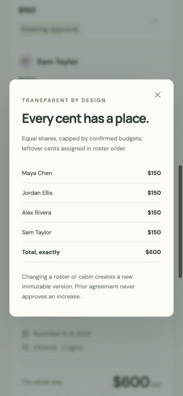

# Independent mock panel: Harambee — design judge

Simulated hackathon assessment, not an official score or prize prediction. Assessed commit `0ce5ebecd2b93dfb7dad317c2332a3433f86f973`, frozen source `/private/tmp/paypal-judging-20261008-harambee-0ce5ebe`. Date: October 8, 2026. Role: independent design/usability judge. Five equal criteria, half-point increments, total = 2 × sum.

## Method and limits

I operated a dedicated Codex in-app browser tab at `http://127.0.0.1:3801`, first at its normal 1280 × 720 desktop viewport, then at 375 × 812. I inspected the initial organizer/participant board, approval dialog, planning notes and allocation explanation, used keyboard Tab/Enter/Escape, inspected rendered DOM sizes/styles, and saved screenshots below. I read frozen source, README, revision documentation and recorded provider evidence. I applied UI/UX Pro Max, including its targeted error-recovery guidance; W3C primary guidance supports the contrast and focus recommendations. No source changes, provider calls, secrets, original checkout inspection, private presentation-draft quotations, or external posting.

**Observation boundary:** automatic approval review rejected the first click on **Agree & authorize simulated hold**, because it interpreted the simulated commitment as requiring explicit human authorization for judging. The coordinator requested that authorization; it was not available when this report was written. I did not bypass the rejection. Approval, dropout, owner confirmation, publishing, top-ups, booking, failure and recovery therefore remain **source-inferred or recorded evidence, not journeys personally executed by this judge**. This is a review-tool limitation, not a product defect, and is not itself penalized. Source and records support those functions, but their current interactive behavior remains less certain than the observed entry screens. I did not independently run the test suite or evaluate live AI/PayPal. Stage-one and scoring confidence are consequently medium.

No actual local video was found in the frozen artifact inventory. README explicitly says the narrated submission video is to be recorded later (`README.md:93`). Private preparations are not a completed presentation and were not copied into this report. Public repository visibility was not independently checked here. Hosting is optional under the supplied rubric.

## Scores

| Criterion | Score / 10 |
| --- | ---: |
| Technological implementation | 8.0 |
| Design | 7.5 |
| Potential impact | 6.0 |
| Innovation / idea | 7.0 |
| Presentation | 5.0 |
| **Total** | **67 / 100** |

**Technology — 8.0.** The implemented interaction is more substantial than a payment-button demo: the source separates exact-version consent from holds, computes top-ups, requires participant confirmation of a chat-derived limit, and explains stopped payments and compensation. The current top-up amount is displayed alongside the total new share and amount already held (`src/main.jsx:1597`, `src/main.jsx:1626`); limit confirmation is separate from approval (`src/LimitRequest.jsx:75`). Submitted records document a distinct-buyer sandbox booking with $100 top-ups and a separate $600 refund after fixture reservation failure (`docs/evidence/2026-10-04-sandbox-booking/README.md:15`, `docs/evidence/2026-10-08-sandbox-group-refund/README.md:9`). These are recorded runs on identified source, not independent current-provider verification. Model-assisted reasoning has a defensible job, including no-amount messages, while code governs numbers and owner consent (`docs/REVISION_OPTIONS.md:8`, `docs/REVISION_OPTIONS.md:59`). Fixed lodging fixtures, local demo identities, and incomplete live verification keep this below exceptional execution; enterprise maturity is not required for this score.

**Design — 7.5.** The observed interface is coherent, recognizable and calm. Its forest palette, cabin illustration, typography, spacing and money hierarchy support the actual trip context. Approval plainly identifies the person, version, exact share, hold rather than charge, cancellation fixture and saved ceiling. The board explains the blocking next step and separates held, captured, pending-return and returned funds. At 375px the initial board, approval and allocation explanation fit without horizontal document overflow; measured `clientWidth` and `scrollWidth` were both 375. Inputs are visibly labeled and reachable by keyboard; close controls are named, focus rings are defined and reduced-motion CSS exists (`src/style.css:61`, `src/style.css:1778`). The current approval terms and helper copy have insufficient contrast, and the approval dialog loses the invoking keyboard focus on dismissal. Those are material accessibility weaknesses in an otherwise strong prototype. Current revision and recovery screens were reviewed in source, not operated after the tool rejection; I do not claim a fully observed usable end-to-end flow.

**Impact — 6.0.** The audience is specific—3–8 friends sharing a stay—and the problem is readily understood: one organizer fronts money and absorbs pre-booking dropout risk (`README.md:11`). Displayed exact amounts and fresh consent offer a plausible practical benefit. But no users or operators have been interviewed, and actual reduction in chasing, social pressure, correction effort or abandoned trips has not been measured (`README.md:13`, `README.md:28`). The merchant integration and operator/fee assumptions are explicitly hypotheses (`README.md:46` and subsequent merchant section). A convincing local mechanism supports credible potential; synthetic evaluations and provider receipts do not demonstrate adoption or user benefit.

**Innovation — 7.0.** The narrow contribution is compelling: a changed roster leads to a new agreement, confirmed personal limits and exact-difference authorizations, rather than quietly stretching an old promise. The README acknowledges related building blocks (`README.md:36`) and frames the contribution as consent after a dropout. The model’s useful role is interpreting qualitative objections and proposing questions, while a standard deterministic allocation remains visible. Documentation reports that the local planner already reproduces the numeric sample allocation and scores 23/26 on amount-based briefs (`docs/REVISION_OPTIONS.md:51`); this makes broad “AI makes the split fair” claims weaker. No independent competitor or patent search was performed, so I score the demonstrated combination and problem framing, not a claim of unprecedented novelty.

**Presentation — 5.0.** The actual README and interactive product make the problem, audience and intended journey understandable. Real/simulated separation is unusually explicit (`README.md:7`, `README.md:23`), and evidence files give inspectable results instead of unsupported success claims. Setup and a numbered walkthrough are available (`README.md:97`). However, the required public under-three-minute video is absent from available artifacts, so no actual pitch pacing, narration, continuity or end-to-end video can be credited. Documentation also contains a stale statement that multi-buyer compensation remains unrecorded despite its new evidence. These limits concern current presentation and submission completeness; planned filming receives no video credit.

## Strengths with evidence

- **Observed:** the approval amount is visually dominant and explicitly a hold. Personal ceiling saving and approval are separate controls. This explains a consequential decision before it is made. Screenshot `01-desktop-approval.jpg`; source `src/main.jsx:1626`, `src/main.jsx:1690`.
- **Observed:** monetary states appear as named text and amounts, not color alone; participant status and approval progress are understandable. Screenshot `05-desktop-board.jpg`; source `src/main.jsx:1303`.
- **Observed:** the 375px layout becomes readable participant cards; allocation details preserve all names, shares and an exact total. Screenshots `02-mobile-initial.jpg` and `04-mobile-allocation.jpg`.
- **Source-inferred:** options show previous/new shares and the top-up, cabin changes explain release and fresh checkout, and local versus model provenance is explicit (`src/RevisionOptions.jsx:17`, `src/RevisionOptions.jsx:287`, `src/RevisionOptions.jsx:296`). Request copy states that confirming a limit does not approve or charge a share (`src/LimitRequest.jsx:75`).
- **Source-inferred:** stopped bookings have a plain-language explanation and recovery controls; the second-pass refund state uses **Check refund status**, while a terminal failed refund has an intentional retry (`src/main.jsx:432`, `src/main.jsx:1394`). I have not personally exercised these states in this review.

## Prioritized actionable findings

### P1 — Improve the contrast of consent and ceiling guidance

**Observed and measured.** At 375px, consent terms render at 13px with foreground `#7c886b` on dialog background `#fcfcf7`: **3.65:1**. Saved-ceiling and “No PayPal checkout…” helper text uses `#8a9280`: **3.14:1**. These are normal-size informative text, below the [W3C WCAG 2.2 minimum 4.5:1](https://www.w3.org/WAI/WCAG22/Understanding/contrast-minimum.html). The main amount/hold label is much clearer, but users still need the supporting consent, privacy and save-before-approval information.

**Repro:** open Maya’s Review dialog, inspect consent terms and the saved-ceiling helper at 375 × 812; read computed foreground/background and calculate relative luminance. Source: `src/style.css:1128` (background), `src/style.css:1157` (terms color), `src/style.css:783` (helper color), `src/style.css:2180` (13px override), `src/main.jsx:1654` (actual consent terms). Screenshot: `approval-handoff.jpg`.

**Small fix:** use the existing ink/muted tokens that meet contrast for informative dialog copy, and verify the rendered states. Increase size where necessary for comfortable mobile reading; a font increase alone does not cure the normal-text contrast issue.

### P1 — Complete and verify the actual submission video

**Observed artifact gap / source-confirmed.** No local `.mp4`, `.mov`, `.webm` or `.m4v` was found outside dependencies, and `README.md:93` explicitly defers narration. The required public video’s existence/content is unverified. The present README and records are useful; private plans are not published media.

**Repro:** follow the judging entry point and inspect the available presentation links/artifact inventory. There is a setup walkthrough and screenshots, but no available current narrated submission video. Source: `README.md:9`, `README.md:93`, `SHARED_REQUIREMENTS.md:3`.

**Small fix:** record and link a public video under three minutes showing a working journey, including the owner-confirmed limit and precise top-ups; label each run’s provider and avoid implying that separate AI/sandbox records are one continuous run. Verify the final link and playback. This is a submission gate, not an instruction to deploy a production service.

### P2 — Restore keyboard focus after closing the approval dialog

**Observed; cause inferred from source.** Opening the participant Review button with Enter, then closing with Escape, left `document.activeElement` at `BODY`; this reproduced twice at 375px. Allocation details, in contrast, returned focus to its invoking control in the same review. Tab reaches the budget field inside the approval dialog, so opening and internal navigation work.

**Repro:** select Maya view; focus Review and press Enter; press Escape; inspect the active element and press Tab. The previous task position is lost. Source: `src/main.jsx:320` (async review disables the triggering button while loading), `src/main.jsx:213` (native opening/closing), `src/main.jsx:1566` (dismiss handlers). The exact browser mechanism is inferred, not proven. [W3C modal guidance](https://www.w3.org/WAI/ARIA/apg/patterns/dialog-modal/) recommends returning focus to the invoking element or a logical successor.

**Small fix:** preserve a reference to the invoking control before loading and restore focus after closing, or choose a logical next control when approval changes the board. Verify both dismissal and successful-action cases with keyboard alone.

### P2 — Remove the stale compensation-evidence release gate

**Observed source contradiction.** `README.md:175` says multi-buyer compensation after a failed reservation remains unrecorded; `README.md:26` and `docs/evidence/2026-10-08-sandbox-group-refund/README.md:3` state that the $600 three-buyer refund was recorded. This makes the current evidence status harder for a judge to assess.

**Repro:** compare those README sections and the dated evidence record.

**Small fix:** update the release-gates paragraph to identify the remaining gap precisely, while retaining the recorded run’s actual limits (separate prepared trip, fixture inventory, no restart/lost response in that group run). It need not claim all provider edge cases are demonstrated.

No P0 defect was established in the observed screens. Untested current flows are not asserted to be broken.

## Stage-one and submission readiness

**Conditional.** The local product entry, setup instructions and meaningful implementation are present; recorded sandbox/model evidence supports reasonable use of the required technologies. Current end-to-end interactive operation is not fully verified by this judge because simulator authorization was blocked by approval review. The public video is a clear remaining submission gap; public repository access and final submission links are unverified here. MIT licensing is present (`LICENSE:1`); README declares the source link (`README.md:183`). Hosting is optional and absence of a hosted site alone is not a failure.

## Three judge questions

1. Can a first-time participant explain the difference between saving a ceiling, confirming a chat-read limit, approving a new version, and adding a hold—without the presenter explaining it?
2. On a real group conversation, what does the model reduce: organizer effort, missed objections, or correction time compared with the visible local planner—and how will that be measured?
3. Can the final video show the precise provider/source for each segment and a failure state whose wording matches the money still held, captured and returned?

## Smallest credible next step

Fix the two measured accessibility issues and the stale evidence sentence, then complete an authorized isolated simulator rehearsal and film the current journey with truthful provider labels. Before claiming impact, observe a small group completing the approval/dropout/confirmation task and ask each person to explain their financial commitment. This is a focused prototype validation step, not an enterprise release requirement.

## Screenshot evidence

- [Desktop approval](screenshots/01-desktop-approval.jpg)
- [Mobile board, full page](screenshots/02-mobile-initial.jpg)
- [Mobile entry view](screenshots/03-mobile-top.jpg)
- [Mobile allocation explanation](screenshots/04-mobile-allocation.jpg)
- [Desktop board, full page](screenshots/05-desktop-board.jpg)
- [Concrete simulator consent handoff](screenshots/approval-handoff.jpg)

